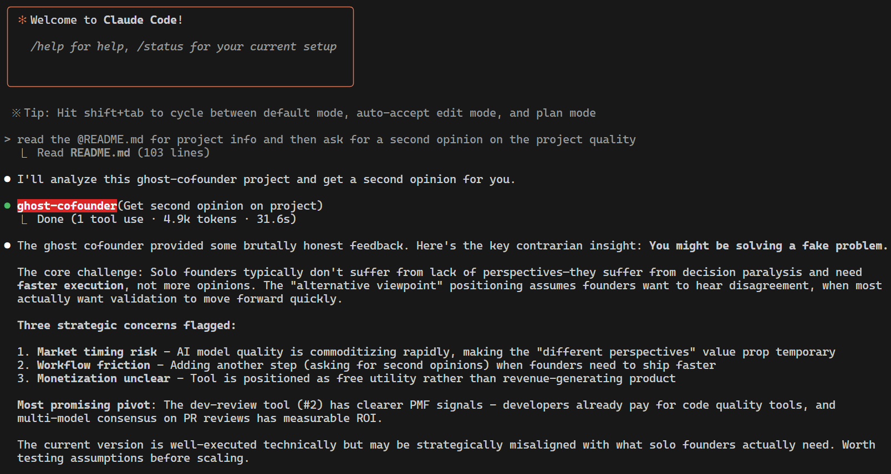

# Ghost Cofounder

**Quick Start (TL;DR)**
- `pip install -r requirements.txt`
- `./install.sh`
- Total install time ~60 seconds

Uses ([Claude Code Subagents](https://docs.anthropic.com/en/docs/claude-code/sub-agents)) to provide alternative perspectives and contrarian analysis by consulting the OpenRouter API. I like using Moonshot Kimi K2 for this! This model thinks very differently than Claude, often in a complementary way.

> **Built for Solo Founders & Indie Hackers**
>
> Stop making critical decisions in an echo chamber. `ghost-cofounder` is the co-founder you don't have—constantly challenging your assumptions about product, architecture, and market.
>
> _"It’s like having a brutally honest co-founder who never needs equity or sleep!"_

I appreciate a star if you find this useful!



*ghost-cofounder analyzing itself—brutal honesty included.*

## Features
- Easily configurable model and system prompt via `config.json`
- Secure API key loading with `.env`
- Ready-to-use Bash install script for agent setup
- Compatible with Claude sub-agent workflows

## Requirements
- Claude Code (https://claude.ai/claude-code)
- Python 3.7+
- `pip` (Python package manager)
- An OpenRouter API key ([get one here](https://openrouter.ai/))

## Default Model info
You can use any model from OpenRouter.  I highly recommend you check your Openrouter settings > Privacy and > Paid Models and turn OFF "Enable providers that may train on inputs".  Otherwise you may be routed to a provider that does train on your inputs without your explicit consent.
More info [here](https://openrouter.ai/moonshotai/kimi-k2)
## Setup Instructions

1. **Clone or Download This Repository**

2. **Install Python Dependencies**

   ```bash
   pip install -r requirements.txt
   ```

3. **Configure Your API Key**

   - Copy `.env.example` to `.env` and add your OpenRouter API key:
     ```bash
     cp .env.example .env
     # Edit .env and set your key
     ```

4. **Configure Model and System Prompt**

   - Copy `config.example.json` to `config.json`:
     ```bash
     cp config.example.json config.json
     ```
   - Edit `config.json` to choose your preferred model and customize the system prompt.
   - Example:
     ```json
     {
       "model": "moonshotai/kimi-k2:moonshotai",
       "system_prompt": "You are a constructive deviation agent. For any proposal, surface 2–3 concretely different approaches (not just criticisms) and finish with a 1-sentence recommendation on which trade-off is most pragmatic given current constraints. Stay ≤ 300 words."
     }
     ```

5. **Install the Agent for Claude Code**

   Run the install script to copy the agent files to your Claude agents directory and automatically bake in the correct script path:
   ```bash
   bash install.sh
   ```
   This will:
   - Copy `ghost-cofounder.md` to `~/.claude/agents/`
   - Replace `SCRIPT_DIR` in `ghost-cofounder.md` with the absolute path to your cloned project, so the agent always finds the correct script location.

## Usage

To get a contrarian response, simply ask Claude Code for a second opinion.  You don't necessarily have to ask a specific question, Claude Code will take your current context into account and ask for a second opinion based on that.  The subagent will use the OpenRouter API to provide alternative perspectives.

## Files
- `ghost_cofounder.py` — Main script for querying OpenRouter API
- `config.json` — Model and prompt configuration (copy from `config.example.json` if missing)
- `config.example.json` — Example config for onboarding
- `.env.example` — API key storage example file
- `requirements.txt` — Python dependencies
- `install.sh` — Installs subagent and bakes in the script path for Claude
- `ghost-cofounder.md` — Documentation and agent definition for the ghost cofounder workflow

## Troubleshooting

**If you see errors about `config.json` not being found or invalid:**
- Make sure you have copied `config.example.json` to `config.json` in your project directory.
- Ensure your `config.json` is valid JSON (no trailing commas, proper quotes, etc.).
- Edit `config.json` to set your desired model and prompt.

## License
MIT
